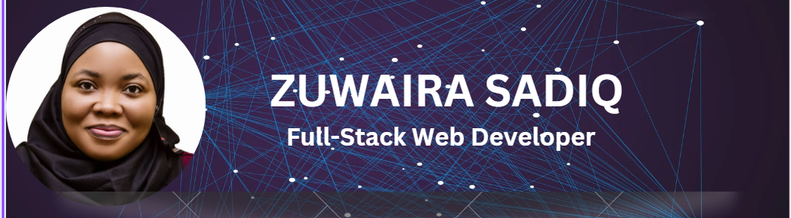

# 💫 About Me:
 
<!-- Hi there, 👋 I am Zuwaira Sadiq I am a full-stack software developer, and a tech enthusiast, and love exploring tech skills.  -->
  

 🔭 I’m currently working on building projects to help solve business problems. 🌱 Always enhancing my developer skills and data sciences with machine learning algorithm operators. 👯 I love innovations and creativity. 💬 Ask me about anything tech 📫 To reach me: email me at: juwairiyyasadiq@gmail.com 😄 Pronouns: She ⚡ Fun fact: I love dancing -->

## 🌐 Socials:
      

# 💻 Tech Stack:
                       	     
# 📊 GitHub Stats:
 
 

## 🏆 GitHub Trophies

### 🔝 Top Contributed Repo

<!-- ### 😂 Random Dev Meme
 -->

---

<!-- Proudly created with GPRM ( https://gprm.itsvg.in ) -->
<!-- 

---

  
Proudly created with GPRM ( https://gprm.itsvg.in ) -->
